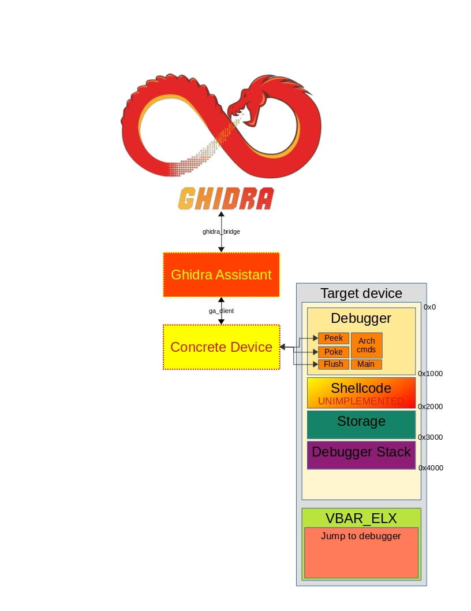
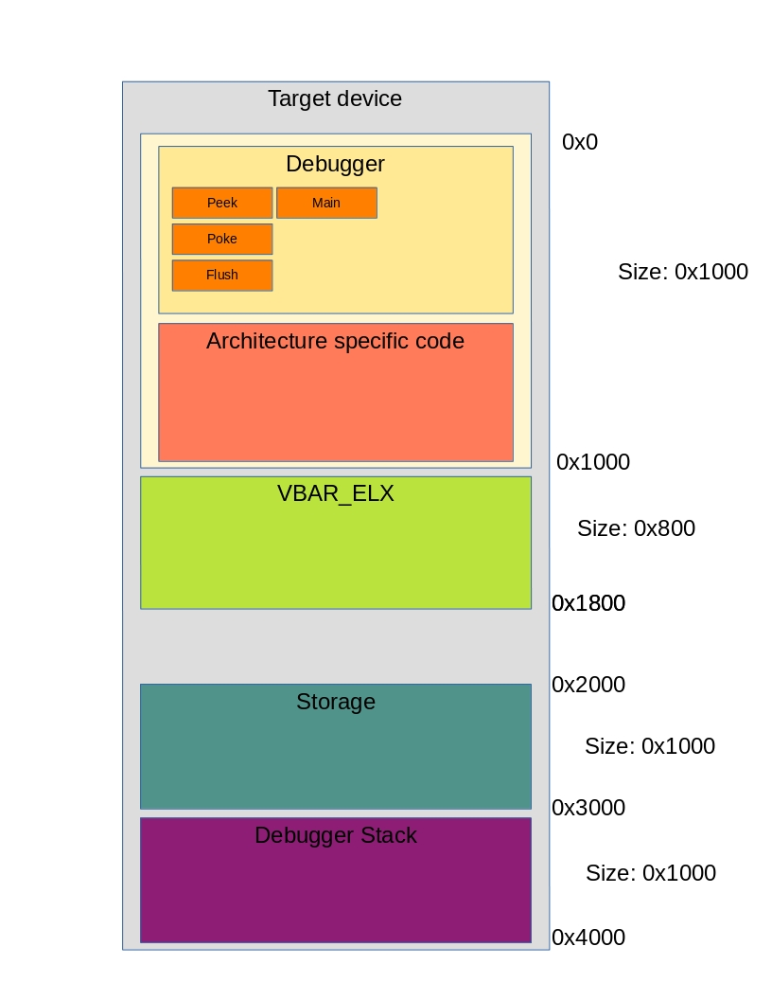

GA debugger
===========
The GA debugger controls a `Gupje <https://github.com/EljakimHerrewijnen/Gupje>`_ stub running on a real hardware target. The stub handles only raw PEEK/POKE and a handful of architecture-specific commands; the GA host-side code provides the higher-level interface.

Supported architectures: ARM64 (AArch64), ARM Thumb, ARM (minimal).

*****************
Debugger overview
*****************

The debugger has two halves: host-side Python code (this repository) and a small shellcode stub that runs on the target. The host sends 4-byte command words; the stub executes them and returns results over the same transport (USB, UART, etc.).

The stub must be loaded and started at the highest available privilege level — EL3 on ARM64. The only bootstrap requirement is a read/write primitive to upload the stub.

Debugger Segments
*****************
Four 4 KiB pages are reserved in device memory:

+----------+--------------------------------------------------------------+
| Segment  | Purpose                                                      |
+==========+==============================================================+
| Debugger | Stub code: handles PEEK/POKE and architecture commands       |
+----------+--------------------------------------------------------------+
| VBAR_ELX | Exception vector table used for software breakpoints        |
+----------+--------------------------------------------------------------+
| Storage  | Saved register state and debugger control fields            |
+----------+--------------------------------------------------------------+
| Stack    | Dedicated stack for the stub (prevents tainting target SP)  |
+----------+--------------------------------------------------------------+

Debugger Commands
*****************
These commands are sent as 4-byte ASCII strings from the host:

+---------+------------------------------------------------------------------------------------------------------------------------------+
| Command | Function                                                                                                                     |
+=========+==============================================================================================================================+
| PING    | Test connection. Device replies with ``b'PONG'``                                                                             |
+---------+------------------------------------------------------------------------------------------------------------------------------+
| PEEK    | Read memory. Host supplies address (8 bytes) + length (4 bytes); device streams the bytes back                              |
+---------+------------------------------------------------------------------------------------------------------------------------------+
| POKE    | Write memory. Host supplies address + length, then sends the data                                                           |
+---------+------------------------------------------------------------------------------------------------------------------------------+
| SELF    | Return the absolute address of ``debugger_main``                                                                             |
+---------+------------------------------------------------------------------------------------------------------------------------------+
| MAIN    | Execute device-specific code (``concrete_main`` in the Gupje stub)                                                          |
+---------+------------------------------------------------------------------------------------------------------------------------------+
| FLSH    | Flush instruction and data caches                                                                                            |
+---------+------------------------------------------------------------------------------------------------------------------------------+
| JUMP    | Jump to a user-supplied address (does not restore processor state)                                                           |
+---------+------------------------------------------------------------------------------------------------------------------------------+
| SPEC    | Dump architecture-specific registers (e.g. ``VBAR_EL3``, ``SCTLR_EL3``) into storage                                       |
+---------+------------------------------------------------------------------------------------------------------------------------------+
| ERET    | Exception Return (does not restore processor state)                                                                          |
+---------+------------------------------------------------------------------------------------------------------------------------------+
| REST    | Restore register state from storage and jump to the address at ``STORAGE + 0xff8``                                          |
+---------+------------------------------------------------------------------------------------------------------------------------------+
| SYNC    | Write register values from storage to the actual hardware registers                                                         |
+---------+------------------------------------------------------------------------------------------------------------------------------+
| TEST    | Stub for quickly testing small C/assembly snippets                                                                           |
+---------+------------------------------------------------------------------------------------------------------------------------------+

Debugger payload
****************
The Gupje stub must be loaded at a known location in device memory. Once it is running the host calls ``auto_debugger_setup()`` to discover the stub's runtime address, dump the current processor state, and read the special-purpose registers.

The host-side Python class for ARM64 is ``GA_arm64_debugger`` (``utils/debugger/debugger_archs/ga_arm64.py``). It inherits from ``BaseArch_debugger`` and provides the full command set.

Debugger VBAR_ELX
*****************
Software breakpoints use the Vector Base Address Register (VBAR). The host generates a vector table in the VBAR page that stores all registers, overwrites SP with the debugger stack, then branches to the debugger stub. This is generated on the fly by ``create_debugger_vbar()``.

On ARM64, register ``X15`` is temporarily corrupted during the handler prologue. The original VBAR address should be saved before hijacking so that execution can be resumed via ``continue_execution()``.

.. note:: Register X15 is corrupted on entry to the VBAR handler.

********************************
Add a new target (Gupje + GA)
********************************
To add support for a new device:

**1. Implement the Gupje stub (C)**

Provide ``send``, ``recv``, and ``concrete_main`` for your hardware transport::

    void send(void *buf, uint32_t size, uint32_t *xfer) { /* USB/UART write */ }
    int  recv(void *buf, uint32_t size, uint32_t *xfer) { /* USB/UART read  */ }
    void concrete_main(uint32_t debugger_addr)          { /* device-specific */ }

Build with the Android NDK (or your target's toolchain) and load it onto the device.

**2. Subclass ConcreteDevice (Python)**

Create a device file (e.g. ``my_device.py``) and implement at least ``read`` and ``write``::

    from ghidra_assistant.concrete_device import ConcreteDevice

    class MyDevice(ConcreteDevice):
        def __init__(self):
            super().__init__()
            self.arch = "ARM64"

        def read(self, length: int) -> bytes:
            # read from USB/UART
            ...

        def write(self, data: bytes) -> None:
            # write to USB/UART
            ...

        def device_setup(self, cd):
            # optional: configure addresses, call copy_functions(), etc.
            cd.ga_debugger_location = 0x100000
            cd.ga_vbar_location     = 0x101000
            cd.ga_storage_location  = 0x102000
            cd.ga_stack_location    = 0x103000
            cd.arch_dbg = GA_arm64_debugger(
                cd.ga_vbar_location, cd.ga_debugger_location, cd.ga_storage_location
            )
            cd.arch_dbg.read  = self.read
            cd.arch_dbg.write = self.write
            cd.copy_functions()

Pass the path to this file when constructing ``ConcreteDevice``::

    from ghidra_assistant.concrete_device import ConcreteDevice
    cd = ConcreteDevice(target_dev="my_device.py")

**3. Add a new architecture (optional)**

To add an architecture not yet supported, create a new class in ``utils/debugger/debugger_archs/`` that inherits from ``BaseArch_debugger`` and implements the methods in the following table:

+---------------------------+--------------------------------------------------+
| Method                    | Description                                      |
+===========================+==================================================+
| ``create_debugger_vbar``  | Generate the vector table shellcode              |
+---------------------------+--------------------------------------------------+
| ``memdump_region``        | Send PEEK and receive bytes                      |
+---------------------------+--------------------------------------------------+
| ``memwrite_region``       | Send POKE and data                               |
+---------------------------+--------------------------------------------------+
| ``jump_to``               | Send JUMP + address                              |
+---------------------------+--------------------------------------------------+
| ``restore_stack_and_jump``| Send REST after writing the target address       |
+---------------------------+--------------------------------------------------+
| ``sync_state``            | Send SYNC                                        |
+---------------------------+--------------------------------------------------+
| ``fetch_special_regs``    | Send SPEC                                        |
+---------------------------+--------------------------------------------------+
| ``add_hook``              | Patch an instruction to branch to the debugger   |
+---------------------------+--------------------------------------------------+

Also create a matching ``Concrete_State`` class (see ``arm64_processor_state.py``) to map the storage page layout for the new architecture.

Example: Nvidia Shield Tablet (ARM Thumb)
*****************************************

.. code-block:: c

    #define BOOTROM_EP1_IN_WRITE_IMM    0x001065C0
    #define BOOTROM_EP1_OUT_READ_IMM    0x00106612

    typedef void (*ep1_x_imm_t)(void *buffer, uint32_t size, uint32_t *num_xfer);
    ep1_x_imm_t usb_recv = (ep1_x_imm_t)(BOOTROM_EP1_OUT_READ_IMM | 1);
    ep1_x_imm_t usb_send = (ep1_x_imm_t)(BOOTROM_EP1_IN_WRITE_IMM | 1);

    void send(void *buffer, uint32_t size, uint32_t *num_xfer) {
        usb_send(buffer, size, num_xfer);
    }

    int recv(void *buffer, uint32_t size, uint32_t *num_xfer) {
        usb_recv(buffer, size, num_xfer);
        return 0;
    }

    void concrete_main(uint32_t debugger) {
        /* device-specific commands here */
    }

